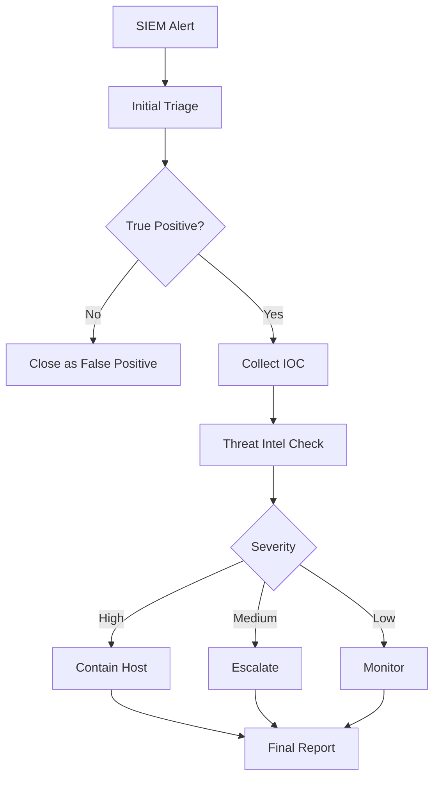

# SOC Alert Triage Workflow

```mermaid
flowchart TD
    A[SIEM Alert] --> B[Initial Triage]
    B --> C{True Positive?}
    C -->|No| D[Close as False Positive]
    C -->|Yes| E[Collect IOC]
    E --> F[Threat Intel Check]
    F --> G{Severity}
    G -->|High| H[Contain Host]
    G -->|Medium| I[Escalate]
    G -->|Low| J[Monitor]
    H --> K[Final Report]
    I --> K
    J --> K
```
